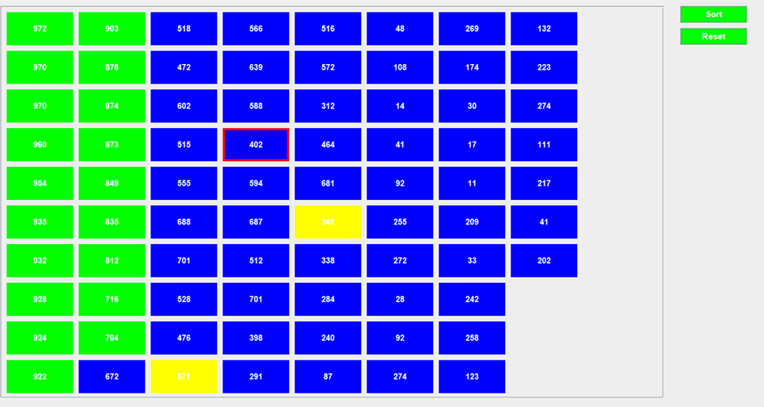
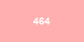
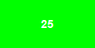

# 	QUICK SORT VISUALIZATION

  <a href="#description">Description</a> •
  <a href="#functional">Functional</a> •
  <a href="#used-technologies">Used technologies</a> •
  <a href="#how-to-use">How To Use</a> •

## Description 
This small application visually displays the process of sorting **N** random numbers using the **Quick Sort** method by visually altering the buttons on the form, which display these numbers.

## Functional
 - The ability to specify the value of the visualization delay argument in milliseconds when starting the application.  
 **java -jar qsv.jar [arg]**, where arg</b> is delay (in ms.)
 - User input of a value N in the range from **[1, 1000]** – the number of random numbers in the range **[1, 1000]**.  The entered value is validated.
 - N buttons are created, each displaying one of the N random numbers. Each column can contain a maximum of 10 buttons. If the buttons do not fit, dynamic horizontal scrolling is added.
 - When the **Sort** button is pressed, sorting begins. The first sort, after generating a new set of N random numbers, is performed in descending order. Subsequent presses of the **Sort** button reverse the sorting direction.
 - The visualization of the sorting process is carried out by changing the appearance of the buttons and their numerical values. The following button visualization markers are possible:

<table>
  <tr>
    <th>Marker</th>
    <th>Description</th>
  </tr>
  <tr>
    <td></td>
    <td valign="center">current <b>pivot</b> number</td>
  </tr>
  <tr>
    <td></td>
    <td valign="center">move to the left</td>
  </tr>
  <tr>
    <td></td>
    <td valign="center">move to the right</td>
  </tr>
  <tr>
    <td></td>
    <td valign="center">swap</td>
  </tr>
  <tr>
    <td></td>
    <td valign="center">sorted</td>
  </tr>
</table>

 - The user can interrupt the sorting process by pressing the **Reset** button. In this case, a form for entering the value of N will be displayed to the user.
 - After N buttons are generated, the user can regenerate the set of random numbers and buttons by pressing a button with a value less than or equal to 30. If a button with a value greater than 30 is pressed, a warning appears: *'Please select a value smaller or equal to 30.'* While the sorting process is running, pressing the buttons will not trigger the actions described above.

## Used technologies

- Java 17
- Maven 3.8.8
- Swing

## How to use

- Copy the project.
- The project can be launched either without parameters or with a single parameter:  
**java -jar qsv.jar [arg]**, where arg</b> is delay (in ms.) for visualisation. The default value of the delay is 500 ms.   
- Enjoy!
